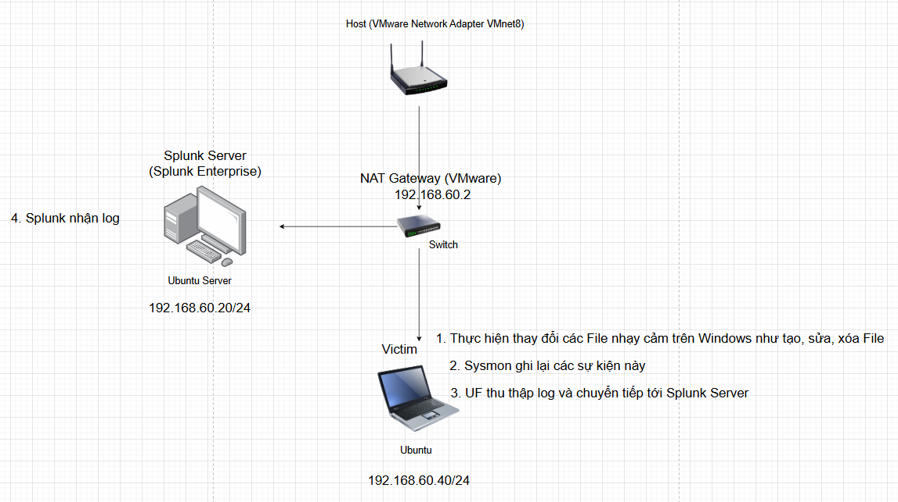

# Lab 8: Theo dõi tính Integrity cho các thư mục nhạy cảm trên Windows

## I. Mục tiêu

- Mục tiêu của Lab này là phát hiện và điều tra các thay đổi trái phép hoặc đáng ngờ trên các file hoặc thư mục nhạy cảm như tạo file mới, sửa file bằng cách thêm luồng ADS, xóa file. Sử dụng Sysmon và Splunk để phát hiện và điều tra hành vi.

## II. Sơ đồ mạng, môi trường và công cụ



- ADS(Alternate Data Streams-Luồng dữ liệu thay thế) là một tính năng đặc biệt của định dạng ổ cứng NTFS có thể giấu file. Một File có 2 luồng:
    - Main Stream (Luồng chính): mở ra xem như bình thường
    - Alternate Data Stream (ADS): bị giấu đi trong một file, giấu cả kích thước của file nếu như xem kích thước bằng cách thông thường.
- Để Sysmon ghi log 15(FileCreateStreamHash-tạo luồng dữ liệu thay thế) và log 23(File delete) thì cần sửa cầu hình Sysmon
    - Tạo file `C:\Users\po230\Downloads\Sysmon\sysmon_lab.xml` với nội dung:
        
        ```powershell
        <Sysmon schemaversion="4.50">
          <HashAlgorithms>md5,sha256</HashAlgorithms>
          <EventFiltering>
            
            <RuleGroup name="" groupRelation="or">
              <FileCreateStreamHash onmatch="exclude">
                </FileCreateStreamHash>
            </RuleGroup>
        
            <RuleGroup name="" groupRelation="or">
              <FileDelete onmatch="include">
                <TargetFilename condition="contains">.exe</TargetFilename>
                <TargetFilename condition="contains">.ps1</TargetFilename>
                <TargetFilename condition="contains">.txt</TargetFilename>
                <TargetFilename condition="contains">Temp</TargetFilename>
                <TargetFilename condition="contains">Downloads</TargetFilename>
              </FileDelete>
            </RuleGroup>
        
          </EventFiltering>
        </Sysmon>
        ```
        
        - Cấu hình này chỉ xóa những file có đuôi là `.exe` `.ps1` `.txt` hoặc file nằm trong thư mục `Temp`, `Downloads` .  Vì hệ thống luôn xóa rất nhiều file, nếu sinh hết log thì sẽ quá tải.
    - Nạp file cấu hình vào Sysmon
        
        ```powershell
        C:\Windows\Sysmon64.exe -c C:\Users\po230\Downloads\Sysmon\sysmon_lab.xml
        ```
        

## III. Mô phỏng thay đổi trái phép

1. Tạo một File mới
    
    ```powershell
    echo MaliciousContent > C:\Windows\System32\malicious.exe
    ```
    
2. Thay đổi tạo một ADS vào File đã có 
    
    ```powershell
    echo "Hidden Data" > C:\Windows\Temp\test_ads.txt:secret_stream
    ```
    
3. Xóa một File quan trọng
    
    ```powershell
    del C:\Windows\Temp\test_ads.txt
    ```
    

## IV. Phát hiện và điều tra

### 1. Phân tích log tạo file

```powershell
02/01/2026 10:41:01.747 AM
LogName=Microsoft-Windows-Sysmon/Operational
EventCode=11
EventType=4
ComputerName=DESKTOP-NDBEF0H
User=NOT_TRANSLATED
Sid=S-1-5-18
SidType=0
SourceName=Microsoft-Windows-Sysmon
Type=Information
RecordNumber=16038
Keywords=None
TaskCategory=File created (rule: FileCreate)
OpCode=Info
Message=File created:
RuleName: EXE
UtcTime: 2026-02-01 03:41:01.733
ProcessGuid: {e237abb6-cb4c-697e-1101-000000002700}
ProcessId: 6472
Image: C:\Windows\system32\cmd.exe
TargetFilename: C:\Windows\System32\malicious.exe
CreationUtcTime: 2026-02-01 03:41:01.733
User: DESKTOP-NDBEF0H\po230
```

- Time `02/01/2026 10:41:01.747 AM`
- User: `DESKTOP-NDBEF0H\po230`
- EventCode = 11 (Create File)
- Image: `C:\Windows\system32\cmd.exe`
- TargetFilename: `C:\Windows\System32\malicious.exe`

### 2. Phân tích Log tạo ADS vào file có sẵn

```powershell
02/01/2026 11:43:57.573 AM
LogName=Microsoft-Windows-Sysmon/Operational
EventCode=15
EventType=4
ComputerName=DESKTOP-NDBEF0H
User=NOT_TRANSLATED
Sid=S-1-5-18
SidType=0
SourceName=Microsoft-Windows-Sysmon
Type=Information
RecordNumber=16814
Keywords=None
TaskCategory=File stream created (rule: FileCreateStreamHash)
OpCode=Info
Message=File stream created:
RuleName: -
UtcTime: 2026-02-01 04:43:57.563
ProcessGuid: {e237abb6-cb4c-697e-1101-000000002700}
ProcessId: 6472
Image: C:\Windows\system32\cmd.exe
TargetFilename: C:\Windows\Temp\test_ads.txt:secret_stream
CreationUtcTime: 2026-02-01 04:19:56.626
Hash: MD5=87EB51FBDCCE288EB5A4A0A07D80C62C,SHA256=80286EC3CFC0DE12EDED8F7BB83C4F37923A670B39EDB9E081D51FC67224E712
Contents: "Hidden Data"   
User: DESKTOP-NDBEF0H\po230
```

- Time `02/01/2026 11:43:57.573 AM`
- User: `DESKTOP-NDBEF0H\po230`
- EventCode=`15` (FileCreateStreamHash)
- Image: `C:\Windows\system32\cmd.exe`
- TargetFilename: `C:\Windows\Temp\test_ads.txt:secret_stream`

### 3. Phân tích Log xóa File

```powershell
02/01/2026 11:44:02.479 AM
LogName=Microsoft-Windows-Sysmon/Operational
EventCode=23
EventType=4
ComputerName=DESKTOP-NDBEF0H
User=NOT_TRANSLATED
Sid=S-1-5-18
SidType=0
SourceName=Microsoft-Windows-Sysmon
Type=Information
RecordNumber=16818
Keywords=None
TaskCategory=File Delete archived (rule: FileDelete)
OpCode=Info
Message=File Delete archived:
RuleName: -
UtcTime: 2026-02-01 04:44:02.470
ProcessGuid: {e237abb6-cb4c-697e-1101-000000002700}
ProcessId: 6472
User: DESKTOP-NDBEF0H\po230
Image: C:\Windows\system32\cmd.exe
TargetFilename: C:\Windows\Temp\test_ads.txt
Hashes: MD5=D41D8CD98F00B204E9800998ECF8427E,SHA256=E3B0C44298FC1C149AFBF4C8996FB92427AE41E4649B934CA495991B7852B855
IsExecutable: false
Archived: true
```

- Time `02/01/2026 11:44:02.479 AM`
- EventCode=`23` (File Delete)
- User: `DESKTOP-NDBEF0H\po230`
- Image: `C:\Windows\system32\cmd.exe`
- TargetFilename: `C:\Windows\Temp\test_ads.txt`

### 4. Phản ứng sự cố

1. Cô lập máy với Internet
    
    ```powershell
    New-NetFirewallRule -DisplayName "Block All Traffic" -Direction Outbound -Action Block
    ```
    
2. Khôi phục các file quan trọng
3. Dừng process độc hại
4. Mapping ATT&CK
    - Tactic: Defense Evasion
        - Technique: Hide Artifacts: NTFS File Attributes
            - ID: T1564.004
        - Technique: Indicator Removal: File Deletion
            - ID: T1070.004