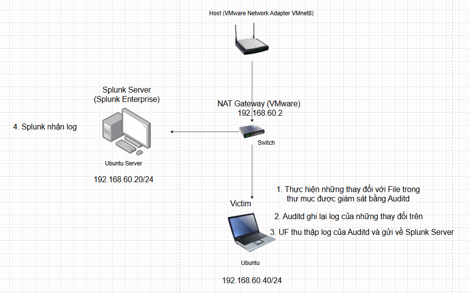

# Lab 9: Theo dõi tính Integrity cho các thư  nhạy cảm trên Linux

# I. Mục tiêu

- Mục tiêu của Lab này là phát hiện và điều tra những hành vi thay đổi bất thường của các File trong thư mục nhạy cảm trên Linux. Sử dụng Auditd và Splunk để giám sát.

# II. Sơ đồ mạng, môi trường và công cụ



## 1. Audit là gì ?

- Auditd (viết tắt của Linux Audit Daemon) là một hệ thống kiểm toán (auditing) cốt lõi được tích hợp sâu trong nhân (Kernel) của hệ điều hành Linux.
- Nó thường được dùng để giám sát:
    - Truy cập hoặc sửa đổi các file nhạy cảm (như `/etc/passwd`, `/etc/shadow`).
    - Thực thi các câu lệnh đặc biệt (như `sudo`, thay đổi giờ hệ thống).
    - Các kết nối mạng đáng ngờ (socket connections).
    - Đáp ứng các tiêu chuẩn bảo mật (như PCI-DSS, HIPAA bắt buộc phải có Auditd).
- Hệ thống Audit hoạt động ở hai tầng:
    - Kernel Level (Tầng nhân): Lắng nghe các System Calls (Lời gọi hệ thống). Ví dụ: Khi bạn gõ lệnh `cat /etc/passwd`, chương trình `cat` sẽ gọi system call `open()`. Auditd sẽ "nghe trộm" được cuộc gọi này ngay tại nhân.
    - User Space (Tầng ứng dụng): Daemon `auditd` sẽ nhận thông tin từ Kernel và ghi xuống file log (thường nằm tại `/var/log/audit/audit.log`).
- Các lệnh chính khi làm việc với Auditd
    - `auditctl`: Dùng để thêm luật (rules) giám sát ngay lập tức (nhưng sẽ mất khi khởi động lại).
    - `ausearch`: Dùng để tìm kiếm trong file log (vì log auditd rất khó đọc bằng mắt thường).
        - *Ví dụ:* `ausearch -f /etc/passwd` (Tìm xem ai đã đụng vào file passwd).
    - `aureport`: Tạo báo cáo tóm tắt (Ví dụ: Thống kê bao nhiêu lần đăng nhập thất bại hôm nay).

## 2. Tải và cấu hình Auditd trên Ubuntu

### 1. Tải và mở Auditd

```powershell
sudo apt update
sudo apt install auditd -y
systemctl start auditd
sudo systemctl enable auditd
```

### 2. Kiểm tra trạng thái của Auditd

```bash
sudo systemctl status auditd
```

### 3. Thiết lập luật giám sát File

1. Sửa file luật Audit:

```bash
sudo nano /etc/audit/rules.d/audit.rules
```

1. Thêm luật sau để giám sát thư mục `/etc/` 

```bash
-w /etc/ -p wa -k file_integrity
```

- Ý nghĩa:
    - `-w`: theo dõi thư mục `/etc/`
    - `-p wa`: giám sát quyền ghi (`w`) và thay đổi thuộc tính (`a`)
    - `-k file_integrity`: keyword để gắn tag cho log
    
    
    
1. Áp dụng luật 

```bash
sudo service auditd restart
sudo auditctl -l #list các quy tắc 
```


## 3. Cấu hình Splunk Universal Forwarder

1. Tạo thêm index `linux_audit` trên Splunk
2. Sửa file cấu hình `inputs.conf` để Splunk Forwarder theo dõi log của auditd và gửi tới Splunk Server
- Mở file `inputs.conf`

```bash
sudo nano /opt/splunkforwarder/etc/system/local/inputs.conf
```

- Thêm dòng sau

```bash
[monitor:///var/log/audit/audit.log]
sourcetype = auditd
index = linux_audit
```

- Khởi động lại Spunk Forwarder

```bash
sudo /opt/splunkforwarder/bin/splunk restart
```

## 4. Tải “**Splunk Add-on for Unix and Linux”** trên Splunk để dễ đọc log của Auditd vì log Auditd rất khó đọc

- Go to More Apps
- Search for **Splunk Add-on for Unix and Linux**
- Install the app
- Nếu tìm kiếm không ra thì vào link này để dowload [https://splunkbase.splunk.com/app/833](https://splunkbase.splunk.com/app/833)

# III. Mô phỏng thay đổi trái phép

## 1. Sửa đổi File /etc/passwd

```powershell
sudo nano /etc/passwd
```

## 2. Xóa một File

```powershell
sudo rm /etc/filetest
```

## 3. Liệt kê logs Audit

```powershell
sudo ausearch -k file_integrity
```

# IV. Phát hiện và điều tra

## 1. Điều tra log sửa /etc/passwd


- Tóm tắt: Người dùng `phong` đã dùng quyền `root` để mở tệp `/etc/passwd` bằng trình soạn thảo `nano`

### 1. Từ log `SYSCALL` : Đây là bản ghi trung tâm, chứa thông tin về "kẻ thực hiện" và "kết quả".

- Người thực hiện: Người dùng có `AUID="phong"` (ID 1000) nhưng đang hoạt động với quyền `UID="root"` (thông qua `sudo` hoặc `su`).
- Lệnh thực thi: `comm="nano"` (trình soạn thảo văn bản) có đường dẫn `exe="/usr/bin/nano"`.
- Hành động hệ thống: `syscall=257` (lệnh openat - dùng để mở tệp tin).
- Kết quả: `success=yes` (thực hiện thành công).

### 2. Từ log `PROCTITLE` - Process Title: cung cấp toàn bộ dòng lệnh và các tham số được thực để chạy một tiến trình cụ thể

Trường `proctitle` được mã hóa Hex. Khi giải mã `6E616E6F002F6574632F706173737764`, kết quả là:

- `nano /etc/passwd`
- Điều này xác nhận người dùng đang cố gắng chỉnh sửa tệp mật khẩu hệ thống.

### 3. Từ log `PATH` : Loại log này mô tả các tệp hoặc thư mục mà lời gọi hệ thống (`SYSCALL`) đã tác động tới

Có hai bản ghi `PATH` giải thích quá trình `nano` tạo tệp tạm để soạn thảo:

- Item 0 (`/etc/`): Thư mục cha đang được truy cập để tạo tệp mới.
- Item 1 (`/etc/.passwd.swp`): Một tệp tạm (swap file) tên là `.passwd.swp` đang được TẠO RA (`nametype=CREATE`). Đây là cơ chế tự động của các trình soạn thảo để lưu dữ liệu tạm khi bạn đang sửa tệp gốc.

### 4. Từ log `CWD` : Current Working Directory

- `cwd="/etc"`: Người dùng đang đứng trực tiếp tại thư mục `/etc` khi gõ lệnh này.

## 2. Điều tra xóa file


### 1. Ai làm và thực hiện lệnh gì?

- Người thực hiện: Vẫn là người dùng `auid=1000` (phong) đang sử dụng quyền `uid=0` (root).
- Lệnh (proctitle): Giải mã chuỗi `726D002F6574632F66696C6574657374` là: `rm /etc/filetest`.
- Công cụ thực thi: `exe="/usr/bin/rm"` (lệnh xóa tệp trên Linux).
- Hành động hệ thống: `syscall=263` (unlinkat) - đây là lệnh hạt nhân để xóa một tệp tin khỏi thư mục.
- Kết quả: `success=yes` (Xóa thành công).

### 2. Đối tượng bị xóa là gì? (Log `PATH`)

- Tên tệp: `/etc/filetest` (`name="/etc/filetest"`).
- Hành động: `nametype=DELETE` (Xác nhận tệp này đã bị gỡ bỏ khỏi hệ thống).
- Vị trí: Việc xóa diễn ra trong thư mục `/etc` (`item=0` với `nametype=PARENT`).

### 3. Ngữ cảnh (Log `CWD`)

- `cwd="/etc"`: Người dùng đang đứng trực tiếp trong thư mục cấu hình hệ thống `/etc` để gõ lệnh xóa.